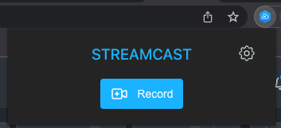

# streamcast

A chrome extension to record your Stream and share the result as a Bitmovin Stream. Built with Vite + React, and Manifest v3.

## Features

- [x] Record your Stream
- [x] Download the result as a video file
- [x] Share the result as a Bitmovin Stream*




_*In order to use the Bitmovin Stream feature, you need to have a valid Bitmovin API key._

## Installing

1. Check if your `Node.js` version is >= **14**.
2. Run `npm install` to install the dependencies.
3. Build the extension with `npm run build`.

## Developing

run the command

```shell
$ cd streamcast

$ npm run dev
```

### Chrome Extension Developer Mode

1. set your Chrome browser 'Developer mode' up
2. click 'Load unpacked', and select `streamcast/build` folder

### Nomal FrontEnd Developer Mode

1. access `http://localhost:3000/`
2. when debugging popup page, open `/popup.html`
3. when debugging options page, open `/options.html`

## Packing

After the development of your extension run the command

```shell
$ npm build
```
